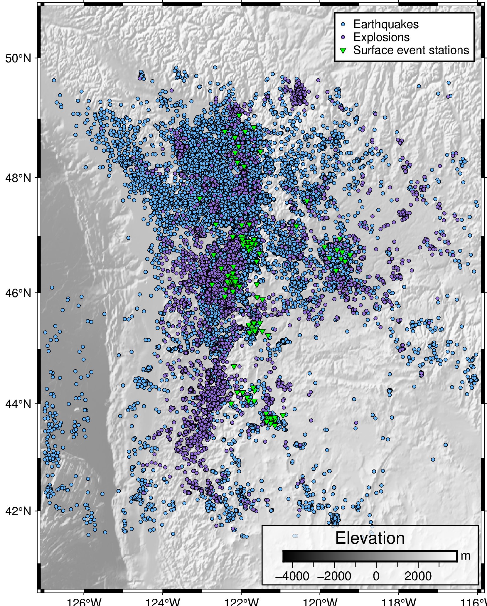
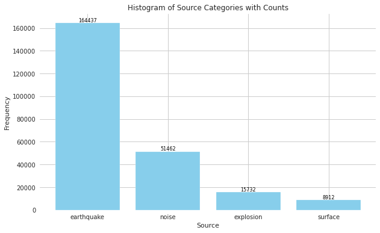

- [Installation](#installation)
- [Usage](#usage)
- [Contributing](#contributing)
- [License](#license)


# Seismic Event Classification in Pacific Northwest

Created by @Akash Kharita (PhD Candidate, University of Washington)

This repository demonstrates the steps towards automated seismic event classification in the Pacific Northwest. We train several supervised machine learning and deep learning models on the dataset acquired in the pacific northwest. This dataset has four classes - (i) Earthquakes, (ii) Explosions, (iii) Noise and (iv) Surface Events. The geographical distribution of these events are shown in the figure below.  and 
The catalog spans over 20 years from 2001 to 2023 and contains over 200k events majority of which are earthquakes, followed by explosions, followed by noise and surface events. For more information about this catalog check out - [Ni et al. 2023](https://seismica.library.mcgill.ca/article/view/368/868)


The model classifies a 150s window with a user-defined stride and outputs a class and probabilities associated with each class for each window. It is trained to classify the data into four classes - 1. Earthquake, 2. Explosions, 3. Noise and 4. Surface Events. 


## Installation

Instructions on how to install...

If we are running this on the cloud we will look at the instructions in this book to understand how to run this notebook on a cloud - [HPSBook](https://seisscoped.org/HPS-book/chapters/cloud/AWS_101.html).

Once we are in a instance we will run this code - 

```
sudo yum install -y git
wget https://repo.anaconda.com/miniconda/Miniconda3-latest-Linux-x86_64.sh
chmod +x Miniconda3-latest-Linux-x86_64.sh 
./Miniconda3-latest-Linux-x86_64.sh -b -p $HOME/miniconda
./miniconda/bin/conda init bash
bash
```

And then we are going to run - 
```
sudo yum groupinstall -y "Development Tools"
```


Following instructions can be followed on your local system as well as on the cloud (after following the instructions above)


Then we will clone the github repository and  install the required dependencies

```
git clone https://github.com/Akashkharita/PNW_Seismic_Event_Classification.git
cd PNW_Seismic_Event_Classification
conda create -y -n surface python=3.9.5
conda activate surface
pip install -r requirements.txt
pip install jupyter
conda install -y ipykernel
python -m ipykernel install --user --name=surface
```

Now we are all set to go! 😃


If you are on cloud run this - 

```
jupyter notebook --ip 0.0.0.0 --allow-root
```

If you are on local machine, just run this - 

```
jupyter notebook
```


## Usage

**Classic Machine Learning**
---

Classic machine learning involves the intermediate step of feature extraction. These features are extracted manually and are easier/more direct to interpret. Following is a description of various notebooks. 
 - The [notebook](notebooks/classification_based_on_physical_features_only.ipynb) shows classification of seismic events using **physics based** and **manual features**. It illustrates the process of downloading features from online repository, processing them, hyperparameter tuning and performance evaluation for balanced and unbalanced datasets at station and event level. It also has sections for feature importance and feature selection.
 - This [notebook](notebooks/classification_based_on_tsfel_features_only.ipynb) shows the same steps but for **tsfel** and **manual** features without including the sections for feature importance.
 - This [notebook](notebooks/classification_based_on_scatnet_features.ipynb) shows the same steps as above notebook but for **scatnet** and **manual** features.
 - This [notebook](notebooks/classification_based_on_combination_of_physical_tsfel_features.ipynb) shows the same steps as above notebook but for combination of **tsfel** and **physical** features
 - This [notebook](notebooks/comparison_of_ml_algorithms.ipynb) shows the comparison of performance of various machine learning algorithms in terms of accuracies, f1-scores and the computaitonal times for the combination of tsfel and physical features.
 - This [notebook](notebooks/testing_with_diff_freq_samp_duration.ipynb) shows the effects of different window lengths, sampling rate and frequencies of the input waveforms on the performance of ML classifier. 
 - The [notebook](notebooks/ML_Classification_Workflow_for_Scoped.ipynb) shows an example of how to process, train and tune the machine learning model and evaluate the results. I also show the importance of including manual parameters in improving the classification performance, in addition to this, I show that this process can also be used to identify potentially mislabeled events. 


## Contributing
Anyone is welcome to contribute to improve the codes and visualization of the results. I am available at my email  - ak287@uw.edu for further collaboration. 

## License

The repository has an MIT License. 
