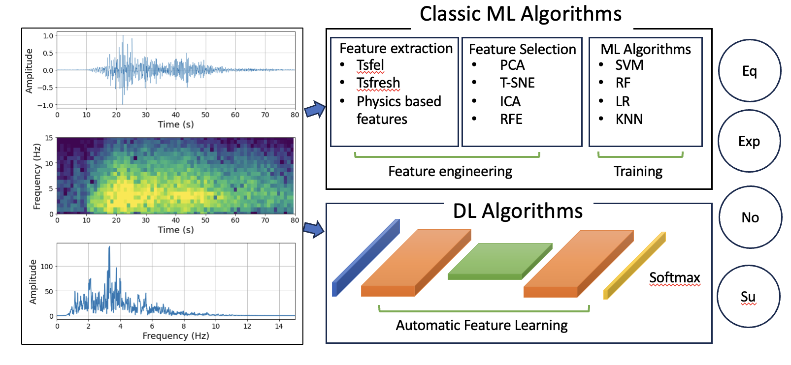

# **Seismic Event Classification in the Pacific Northwest**  

📌 **Created by**: @Akash Kharita (PhD Candidate, University of Washington)  

This repository provides a framework for **automated seismic event classification** in the Pacific Northwest. We train multiple **machine learning (ML) and deep learning (DL) models** on a dataset spanning **2001–2023**, containing **200K+ events** across four classes:  

1. **Earthquakes**  
2. **Explosions**  
3. **Noise**  
4. **Surface Events**  

More information about these events can be found in this [paper](https://seismica.library.mcgill.ca/article/view/368)

The primary objective is to **evaluate and compare various ML and DL approaches** to improve surface event classification while balancing accuracy, interpretability, and efficiency. The key differences between ML and DL techniques are illustrated below:  

  


## Contents
- [Installation](#installation)
- [Usage](#usage)
- [Contributing](#contributing)
- [License](#license)


---

## **🚀 Installation**  

For cloud-based execution, refer to [HPSBook](https://seisscoped.org/HPS-book/chapters/cloud/AWS_101.html).  

### **1️⃣ Set up environment**  
```bash
sudo yum install -y git  
wget https://repo.anaconda.com/miniconda/Miniconda3-latest-Linux-x86_64.sh  
chmod +x Miniconda3-latest-Linux-x86_64.sh  
./Miniconda3-latest-Linux-x86_64.sh -b -p $HOME/miniconda  
./miniconda/bin/conda init bash  
bash  
sudo yum groupinstall -y "Development Tools"
```


### **2️⃣ Clone the repository & install dependencies** 

```
git clone https://github.com/Akashkharita/PNW_Seismic_Event_Classification.git  
cd PNW_Seismic_Event_Classification  
conda create -y -n surface python=3.9.5  
conda activate surface  
pip install -r requirements.txt  
pip install jupyter  
conda install -y ipykernel  
python -m ipykernel install --user --name=surface  
```

### **3️⃣ Launch Jupyter Notebook**

- **Cloud**
  ```
  bash
  jupyter notebook --ip 0.0.0.0 --allow-root

  ```
  

- **Local**
  
  ```
  bash
  jupyter notebook
  ```

## 🛠️ Usage
### 📌 Classic Machine Learning
Feature extraction is a critical step in ML-based seismic classification. This repository includes various approaches:

- Physical Features: [Notebook](notebooks/classification_based_on_physical_features_only.ipynb)
- TSFEL Features: [Notebook](notebooks/classification_based_on_tsfel_features_only.ipynb)
- ScatNet Features: [Notebook](notebooks/classification_based_on_scatnet_features.ipynb)
- Combined Feature Sets( Physical + Tsfel): [Notebook](notebooks/classification_based_on_combination_of_physical_tsfel_features.ipynb)
- Algorithm Comparison: [Notebook](notebooks/comparison_of_ml_algorithms.ipynb)
- Sampling Rate & Window Size Study: [Notebook](notebooks/testing_with_diff_freq_samp_duration.ipynb)
- Full ML Workflow for SCOPED: [Notebook](notebooks/ML_Classification_Workflow_for_Scoped.ipynb)


### 📌 Feature Extraction Scripts
Scripts for extracting different types of features:

- Physical Features:
[Feature extraction](feature_extraction_scripts/physical_feature_extraction_scripts/physical_feature_extraction_combined_script.py) and
[Feature calculation script](feature_extraction_scripts/physical_feature_extraction_scripts/seis_feature.py)

- TSFEL Features:
[Feature extraction](feature_extraction_scripts/tsfel_feature_extraction_scripts/tsfel_feature_extraction_combined_script.py)

- ScatNet Features:
[Feature extraction](feature_extraction_scripts/scatnet_feature_extraction_scripts/scatnet_feature_extraction_comcat_part1_p_50_100.py) 


### 📌 Deep Learning
Deep learning models enable automatic feature extraction:

- Neural Network Architectures: [Script](https://github.com/Akashkharita/PNW_Seismic_Event_Classification/blob/main/deep_learning/scripts/neural_network_architectures.py)
- Training & Validation: [Notebook](deep_learning/testing_deep_learning_architectures.ipynb)
- Testing on Common Dataset: [Notebook](deep_learning/testing_on_a_common_test_dataset.ipynb) 


### 🤝 Contributing
Contributions to code, visualization, and methodology are welcome! Contact me at ak287@uw.edu for collaborations.


### 📜 License
This repository is licensed under the [MIT](LICENSE) License.

